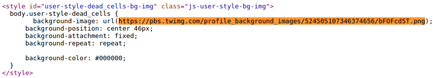

# Twitter Background Restorer

A temporary solution to the web twitter's very good decision to make the home background a horrible grey colour. Lol

[Download from the Web Store](https://chrome.google.com/webstore/detail/twitter-background-restor/gcjejnlljikllkloanankijokfbaelhi)

## Installation

Install from the Web Store and click on 'Options' below the extension.

This is where it gets a little unwieldy, but whatever. Go to your twitter settings and click on the Design tab. Make sure the background image you want to use appears in the preview window in the 'Customize your own' section.

Press ctrl+u to view the source of the page. Search (with ctrl+f) through this source code for "background_image_preview". In this tag, there should be some code specifying the URL of your background image, like this:

Copy and paste this URL for your background image into the extension settings, and choose whether it is a tiled image or not. You can also just set it to use a less horrible background colour by filling in the colour textbox with a hex value, and changing the dropdown to 'background colour'. Hit save, refresh twitter and it should work

until twitter gets rid of backgrounds entirely but hey

### Links

This tiny bit of javascript-barf has been linked to from [The Guardian](http://www.theguardian.com/technology/2015/jul/21/twitter-removes-background-images-timeline-fix-chrom-plugin), [iDigitalTimes](http://www.idigitaltimes.com/twitter-background-image-disappeared-heres-how-fix-it-460114), [VentureBeat](http://venturebeat.com/2015/07/21/as-twitter-turns-off-timeline-background-images-one-developer-has-already-built-a-workaround/), [Gizmodo](http://www.gizmodo.jp/2015/07/_twitter_2.html) and [Lifehacker](http://www.lifehacker.co.uk/2015/07/21/how-to-get-your-background-wallpaper-back-on-twitter)!
